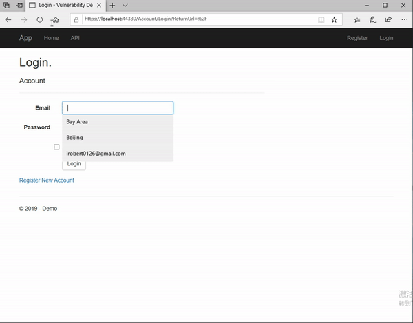
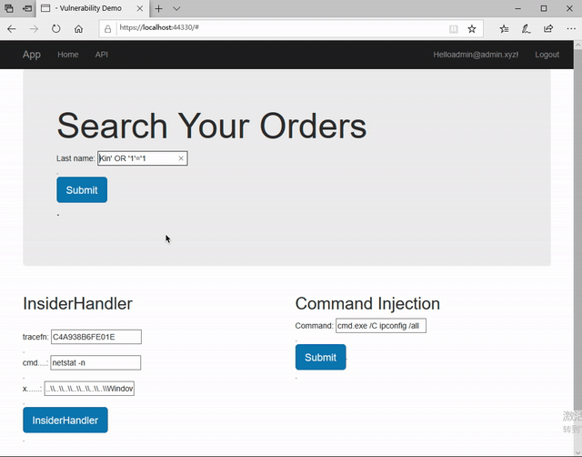
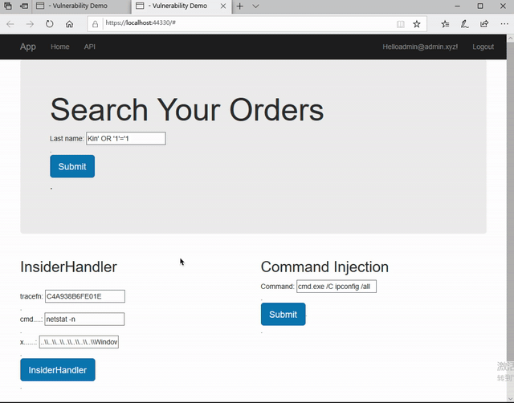
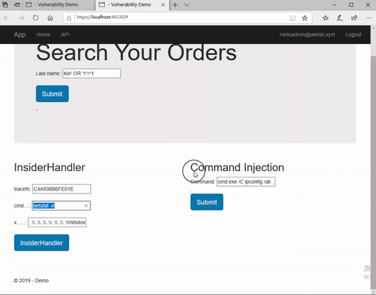

# Code

## Target .Net Framework 4.6.1

## File
- [controller/HomeController.cs::QueryOrder](demo/Controller/HomeController.cs#L41)
- [controller/HomeController.cs::RuntTimeExec](demo/Controller/HomeController.cs#L99)
- [controller/HomeController.cs::insiderHandler](demo/Controller/HomeController.cs#L166)
- 
## Visual Studio Solution (Including libraries)

[Dropbox Link](https://www.dropbox.com/s/x390t6hhbfuc2yb/Demo.zip?dl=0)

# Demo
## Register / Login

## SQL Injection Attack
 

## Insider Handler

## Command Injection

